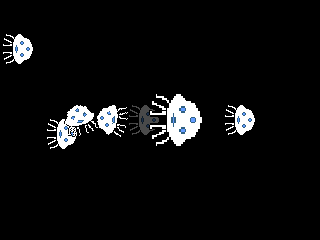
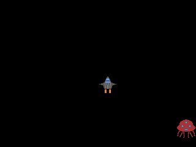
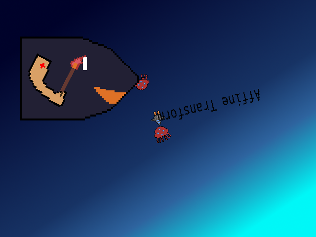
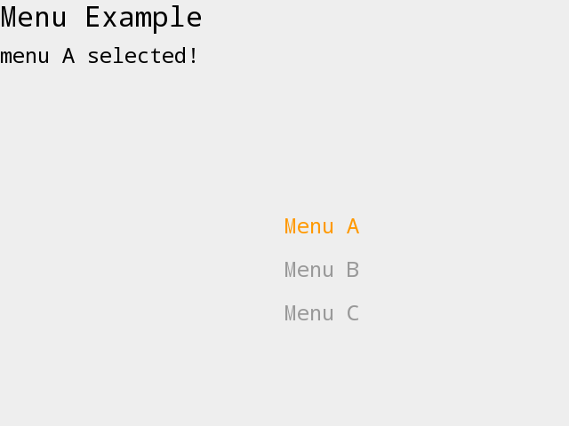
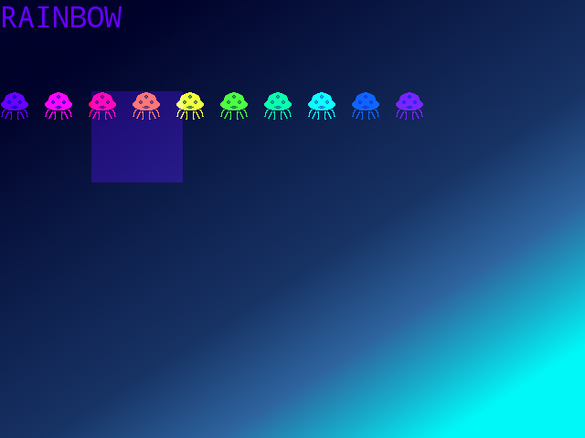
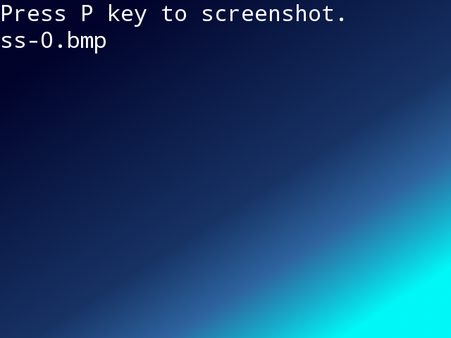
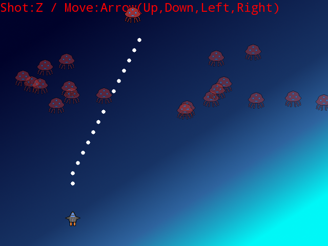

# bismuth examples

to run these examples, you need to setup bismuth and bismuth-tools.

- bismuth-tools <https://github.com/kabies/bismuth-tools>
- bismuth <https://github.com/kabies/bismuth>

after done setups bismuth and bismuth-tools, you can run examples like: `bismuth.rb examples/rainbow.rb`

# licenses

example codes are distributed under the unlicense: <http://unlicense.org>

see licenses directory about licenses of assets.

# screenshots

## actions, actions-composite, animation

## affine-transform

## menu

## pong

## rainbow

## screenshot

## shooting

