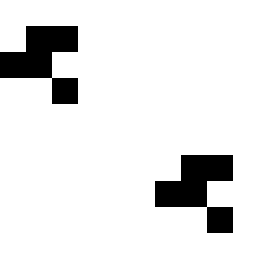
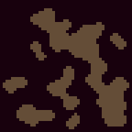

# bismuth examples

to run these examples, you need to setup bismuth and bismuth-tools.

- bismuth-tools <https://github.com/kabies/bismuth-tools>
- bismuth <https://github.com/kabies/bismuth>

after done setups bismuth and bismuth-tools, you can run examples like: `bismuth.rb examples/rainbow.rb`

# Setup

1. clone [bismuth-tools](https://github.com/kabies/bismuth-tools) and [bismuth](https://github.com/kabies/bismuth)
2. build mruby in bismuth-tools directory
3. create configuration file `.env` in bismuth-example directory

`.env` file require `BISMUTH_LOAD_PATH`. for example:

```
BISMUTH_LOAD_PATH=/path/to/bismuth
```

# Screenshots

## actions, actions-composite, animation


## affine-transform


## menu


## game of life


## cave generator


## pong


## rainbow


## screenshot


## shooting


# Licenses

example codes are distributed under the unlicense: <http://unlicense.org>

see licenses directory about licenses of assets.
